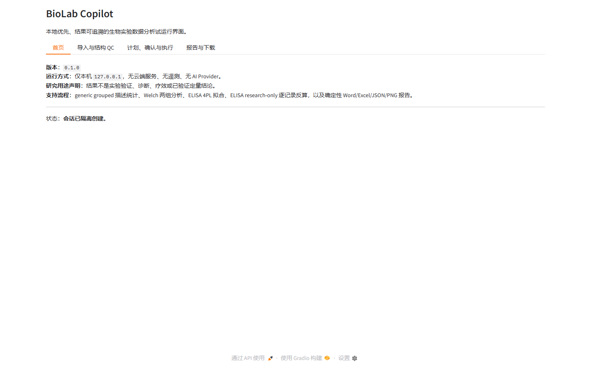
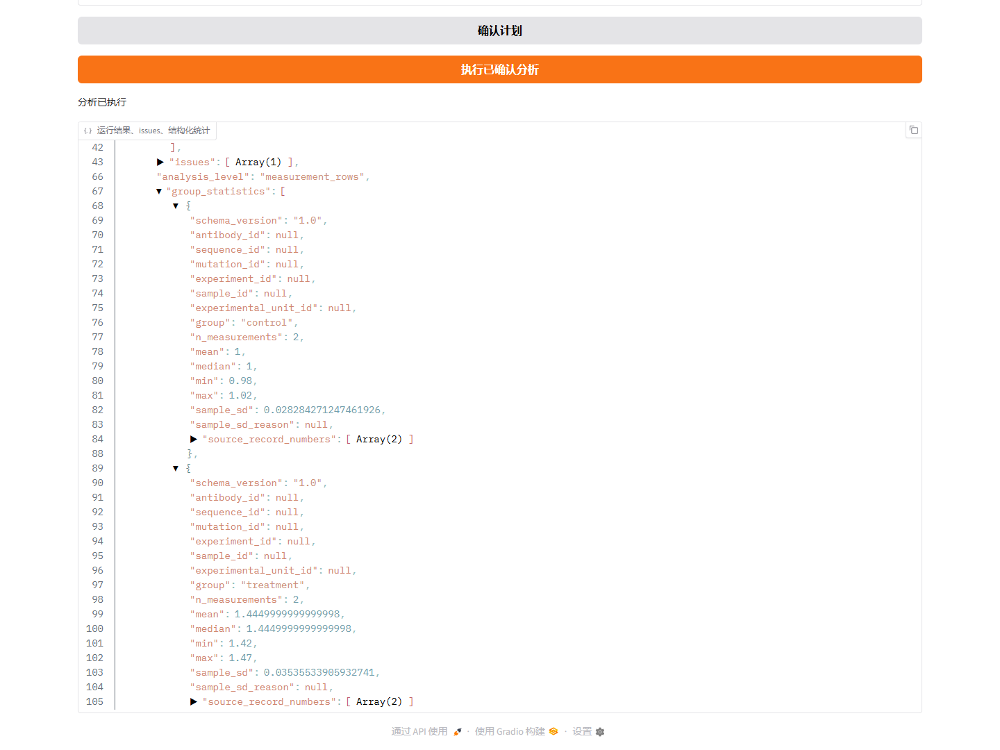
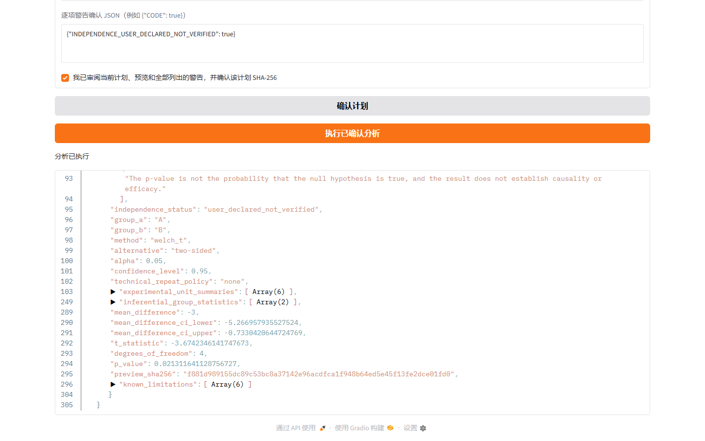
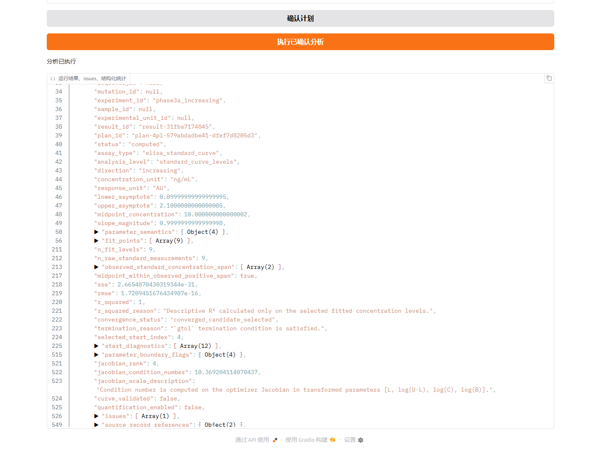
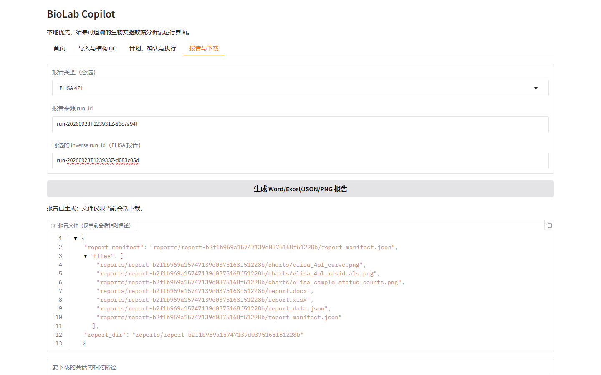
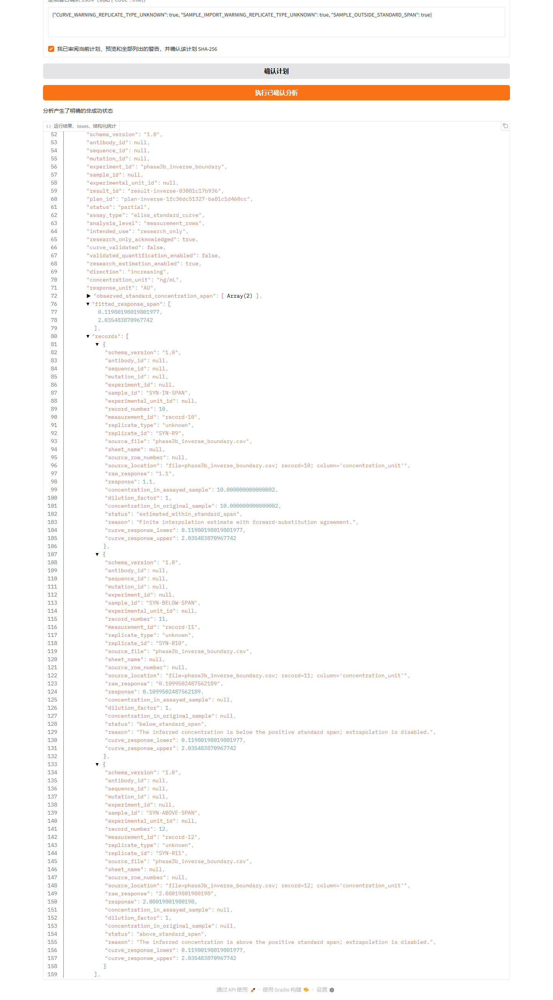
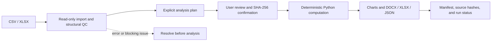

# BioLab Copilot

**Local-first, research-use laboratory data analysis workbench for reproducible QC, statistics, ELISA fitting, and scientific reporting.**

[](https://github.com/jie4578/BioLab-Copilot/actions/workflows/ci.yml)

[](https://github.com/jie4578/BioLab-Copilot/releases/tag/v0.1.0)
[](LICENSE)

BioLab Copilot imports CSV/XLSX experiment data, reports structural QC, asks the user to confirm
an explicit plan, runs deterministic scientific calculations, and creates traceable reports.
It runs locally; no cloud upload is required. AI and LLM features are not included.

> **Research use only.** The software is not clinically validated, is not production software,
> and does not replace scientific review.

## Screenshots

These are genuine captures from the local Gradio application using the fabricated examples in
`examples/`. No mock interface or real experiment data is shown.



The confirmed Generic grouped workflow reports measurement-row summaries without presenting them
as independent biological sample counts.



The restricted Welch workflow keeps the user-declared independence warning visible and reports the
pre-specified two-sided comparison.



The ELISA workflow separates numerical curve fitting from assay validation. The fitted parameters
remain accompanied by `curve_validated=false` and `quantification_enabled=false`.





Research-only inverse estimates are emitted per measurement row. Out-of-span rows retain null
concentrations rather than receiving extrapolated values.



See [the screenshot provenance and recapture checklist](docs/images/README.md) for the exact
synthetic inputs and privacy review.

## Supported workflows

| Workflow | What it does | Important boundary |
| --- | --- | --- |
| Generic grouped descriptive statistics | Describes measurement rows by group | Does not establish biological independence |
| Declared experimental-unit Welch analysis | Runs one explicitly planned, two-group Welch comparison | Independence is user-declared, not software-verified |
| ELISA 4PL curve fitting | Fits a declared increasing or decreasing standard curve | `curve_validated=false`; fitting does not validate an assay |
| ELISA inverse estimation | Estimates each sample measurement within the positive standard span | `intended_use=research_only`; no extrapolation or validated quantification |

## Reproducible workflow



The scientific layer produces every number. A future language-model explanation layer is not
present and is not required to run the application.

## Scientific safeguards

- Original input bytes are preserved and hashed; imported values are not silently rewritten.
- QC flags problems for review. It does not silently clean data or remove outliers.
- Assay type, column mapping, analysis design, and plan confirmation are explicit.
- Technical repeats are not automatically treated as independent biological samples.
- Welch independence is recorded as user-declared, not verified by the software.
- ELISA inverse estimates outside the positive standard span remain unestimated; no extrapolation
  is performed.
- ELISA results retain `curve_validated=false`,
  `validated_quantification_enabled=false`, and `intended_use=research_only`.
- AI does not calculate, alter, or interpret results because no AI/LLM integration is included.

## Windows quick start

1. Double-click `setup_windows.bat` once to create the project-local environment and install
   declared dependencies.
2. Double-click `start_local.bat` for daily use, then open `http://127.0.0.1:7860`.

The server is local-only (`127.0.0.1`), with Gradio sharing and analytics disabled. Initial
dependency installation may need internet access unless packages are cached; application runs
and scientific analysis work offline after installation. See
[docs/INSTALL_WINDOWS.md](docs/INSTALL_WINDOWS.md) for prerequisites and troubleshooting.

## Reports

Completed workflows can produce deterministic PNG charts and report packages containing
`report.docx`, `report.xlsx`, `report_data.json`, and `report_manifest.json`. Reports retain
warnings, plan and input provenance, software versions, and artifact hashes. Rendering does not
recalculate statistics. See [docs/REPORTING_DEFINITIONS.md](docs/REPORTING_DEFINITIONS.md).

## Synthetic demo

Use only fabricated files in `examples/`. Follow the 3–5 minute walkthrough in
[docs/DEMO_GUIDE.md](docs/DEMO_GUIDE.md); example files and their intended scenarios are listed
in [examples/README.md](examples/README.md).

## Current status

- Version: `v0.1.0`; Python support metadata: 3.11–3.13.
- Windows local pilot; Python 3.13.9 is verified on the current host. Python 3.11 and 3.12
  have not been verified on that host.
- CI is configured for Python 3.11, 3.12, and 3.13. Check the Actions workflow for current
  job results.
- Research-use MVP; not a clinical, GxP, or production system.

## Limitations

- No clinical/GxP use or validated quantitative bioanalysis.
- No paired, multigroup, multifactor, longitudinal, or clustered inference.
- No 5PL, LOD/LLOQ/ULOQ, or validated quantification range.
- No automatic verification of biological independence.
- No LLM interpretation or multi-user collaboration.

## Project map

```text
src/biolab_copilot/   contracts, ingestion, QC, statistics, reports, and local UI
examples/             fabricated CSV inputs and explicit synthetic analysis designs
docs/                 installation, science boundaries, architecture, and demo guidance
tests/                contract, import, scientific, reporting, and UI service tests
```

See [docs/ARCHITECTURE.md](docs/ARCHITECTURE.md) for module boundaries,
[docs/STATISTICS_DEFINITIONS.md](docs/STATISTICS_DEFINITIONS.md) for statistical semantics,
[SECURITY.md](SECURITY.md) for reporting security issues, and
[CONTRIBUTING.md](CONTRIBUTING.md) for contribution guidance.
