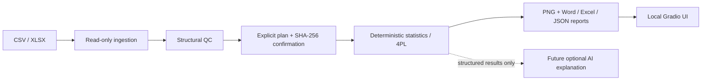

# BioLab Copilot

BioLab Copilot is a local-first foundation for traceable biological experiment data analysis. The planned workflow is: import data, profile and quality-control it, confirm an analysis plan, run deterministic statistics, create charts, optionally obtain constrained AI-assisted interpretation, and export Word/Excel/JSON artifacts.

## Current status

Phase 0 is committed as the local baseline, Phase 1 is committed as `4bb5e06`, Phase 2A is
committed as `1b5cd90`, and the Phase 2B baseline is committed as `fe549c9`. Phase 1 provides
read-only CSV/XLSX ingestion, explicit mappings, type parsing, structural QC, and traceable JSON
outputs. Phase 2A adds confirmed measurement-row descriptive statistics for `generic_grouped`.
Phase 2B adds a confirmed, two-group, experimental-unit-level Welch comparison. Phase 3A is
baselined locally as `9280e0a` and adds a confirmed, standard-only ELISA 4PL fit. Phase 3B is
committed as `99a42974384258337b795435d605232a576f175e` and adds research-only per-measurement
inverse estimates. Phase 4A is committed as `8f232b340e354ff211cbfc7f953aaedf0c3aa280` and
adds deterministic report packages. Phase 4B is committed as
`a9273a431488e1776eec00cb73653854ab0c9adf` and adds a local-only Gradio pilot over the existing
backends. Phase 4C is committed as `6c6a1f8f9d82d73bf9dd86ee7fd5d0bf74c8b8d0` and hardens the
local pilot for Windows packaging. Phase 4D is the current uncommitted public-release
preparation work. The package version is `0.1.0`, sourced from
`src/biolab_copilot/__init__.py` and exposed to packaging dynamically.

Phase 2A and 2B intentionally contain no ELISA processing or fitting. Phase 3A intentionally
contains no unknown-sample back-calculation. Automatic outlier handling, imputation,
transformation, unit conversion, chart, AI integration, report renderer, database, network
function remains out of scope for the scientific core. Phase 2B does not prove independence and does not
infer biological sample size. Phase 3B preserves `curve_validated=false` and
`validated_quantification_enabled=false`, requires explicit research-use acknowledgement, does
not aggregate unknown repeats, and refuses extrapolation outside the positive standard span.

## Windows quick start

One-time installation:

```powershell
setup_windows.bat
```

Daily startup:

```powershell
start_local.bat
```

The scripts resolve the project directory from their own location and use `.venv`. The supported
range is Python 3.11 through 3.13; Python 3.13 is the current verified Windows runtime, while
Python 3.11 and 3.12 are not yet verified on this host. The scripts do not modify system settings
and do not expose a public Gradio share link. Manual development commands and troubleshooting are documented in
[docs/INSTALL_WINDOWS.md](docs/INSTALL_WINDOWS.md).

For quality checks inside the activated project environment:

```powershell
python -m pytest -q
ruff check .
mypy src
```

## Phase 1 CLI

Run from the project root. The package can be used directly from the source tree with `PYTHONPATH=src` or after editable installation.

```powershell
$env:PYTHONPATH = "$PWD\src"
python -m biolab_copilot.cli list-sheets templates\biolab_copilot_templates.xlsx
python -m biolab_copilot.cli suggest-mapping examples\generic_grouped_normal.csv --experiment-type generic_grouped
python -m biolab_copilot.cli import examples\generic_grouped_normal.csv `
  --experiment-type generic_grouped `
  --mapping '{"sample_id":"sample_id","group":"group","measurement":"measurement","replicate":"replicate_id"}' `
  --output-dir outputs\phase1
```

The mapping direction is `source_column -> canonical_field`. Each run creates a new directory with `dataset_profile.json`, `validation_issues.json`, `imported_data.json`, and `run_manifest.json`. Exit code `0` means no error/blocking QC issue; `2` means an input or QC error/blocking issue; `3` means an unexpected CLI failure. Warnings are retained and do not delete records.

## Phase 2A CLI

Generate a plan from an unchanged Phase 1 `imported_data.json` artifact. Plan generation never
confirms the plan:

```powershell
$env:PYTHONPATH = "$PWD\src"
python -m biolab_copilot.cli generate-plan runs\<phase1-run>\imported_data.json `
  --output-dir outputs\phase2a-plans
```

Review the generated `analysis_plan.json`, set `confirmed` to `true`, set each listed
`warning_confirmations` entry to `true` only after review, and calculate the resulting file
SHA-256. Execute only with that exact explicit hash:

```powershell
python -m biolab_copilot.cli execute-plan outputs\phase2a-plans\<plan-run>\analysis_plan.json `
  --confirm-plan-sha256 <sha256-of-confirmed-plan> `
  --output-dir outputs\phase2a
```

Phase 2A emits `analysis_plan.json`, `analysis_result.json`, `analysis_issues.json`, and
`run_manifest.json` in a new run directory. `analysis_level=measurement_rows` and
`independent_biological_n=null` are intentional; a computed result does not establish biological
independence or inferential validity.

## Phase 2B CLI

Phase 2B requires a project-local Phase 1 `generic_grouped` import artifact and a separate JSON
design declaration. The declaration must explicitly identify the experimental-unit field, two
groups, the `none` or `mean` technical-repeat policy, and the user assumptions:

```powershell
python -m biolab_copilot.cli generate-welch-plan runs\<phase1-run>\imported_data.json `
  --design-file examples\phase2b_design.json `
  --output-dir outputs\phase2b-plans
```

Review both `experimental_units.json` and `analysis_plan.json`. Set `confirmed=true` and each
listed `warning_confirmations` entry to `true` only after review. Confirm the resulting plan
SHA-256 explicitly:

```powershell
python -m biolab_copilot.cli execute-welch outputs\phase2b-plans\<plan-run>\analysis_plan.json `
  --confirm-plan-sha256 <sha256-of-confirmed-plan> `
  --output-dir outputs\phase2b
```

Successful Phase 2B runs emit the plan, experimental-unit preview, result, issue list, and
manifest in a new run directory. `analysis_level=experimental_units`,
`independent_biological_n=null`, and `independence_status=user_declared_not_verified` are
intentional. The minimum of two experimental units per group is a computation precondition, not
evidence that a study has adequate sample size or valid assumptions.

## Phase 3A CLI

Phase 3A accepts only an `elisa_standard_curve` import artifact and a separate explicit design
declaration. The declaration fixes the curve direction, concentration/response units, replicate
policy, optimizer settings, numerical bounds, and diagnostic thresholds. It never guesses a
direction or model:

```powershell
python -m biolab_copilot.cli generate-4pl-plan runs\<phase1-run>\imported_data.json `
  --design-file examples\phase3a_design_increasing.json `
  --output-dir outputs\phase3a-plans
```

Review `standards_preview.json` and `analysis_plan.json`, then set `confirmed=true`, explicitly
confirm each listed warning, and calculate the resulting plan SHA-256:

```powershell
python -m biolab_copilot.cli execute-4pl outputs\phase3a-plans\<plan-run>\analysis_plan.json `
  --confirm-plan-sha256 <sha256-of-confirmed-plan> `
  --output-dir outputs\phase3a
```

The run emits `analysis_plan.json`, `standards_preview.json`, `curve_fit_result.json`,
`analysis_issues.json`, and `run_manifest.json`. The fit uses the declared 4PL direction and
standard concentration levels only. Sample, blank, and control rows remain in the preview but
are excluded; `curve_validated=false` and `quantification_enabled=false`, so no unknown-sample
concentration is calculated. See [docs/ELISA_4PL_DEFINITIONS.md](docs/ELISA_4PL_DEFINITIONS.md).

See [PLAN.md](PLAN.md), [docs/ARCHITECTURE.md](docs/ARCHITECTURE.md), and [docs/PRODUCT_SPEC.md](docs/PRODUCT_SPEC.md) for the controlled roadmap. This project is not production-ready and has not completed scientific validation.

## Phase 3B CLI

Phase 3B consumes an unchanged, successfully converged Phase 3A `curve_fit_result.json` and an
explicit research-use inverse design. The design must declare context compatibility and either a
mapped `dilution_factor` field or an explicit uniform factor, including an explicit `1` for
undiluted samples:

```powershell
python -m biolab_copilot.cli generate-elisa-inverse-plan `
  outputs\phase3a\<curve-run>\curve_fit_result.json `
  --design-file examples\phase3b_inverse_design.json `
  --output-dir outputs\phase3b-plans
```

Review `sample_preview.json` and `analysis_plan.json`, set `confirmed=true`, explicitly confirm
each listed warning, and calculate the resulting plan SHA-256. Then execute with that exact hash:

```powershell
python -m biolab_copilot.cli execute-elisa-inverse `
  outputs\phase3b-plans\<plan-run>\analysis_plan.json `
  --confirm-plan-sha256 <sha256-of-confirmed-plan> `
  --output-dir outputs\phase3b
```

The output is per measurement row and uses
`concentration_in_assayed_sample`, `dilution_factor`, and
`concentration_in_original_sample`. Out-of-span rows remain null and diagnostic rather than
being extrapolated. See [docs/ELISA_4PL_INVERSE_DEFINITIONS.md](docs/ELISA_4PL_INVERSE_DEFINITIONS.md).

## Phase 4A reporting CLI

Phase 4A renders deterministic charts and fixed Word/Excel/JSON report packages from completed,
hash-validated upstream artifacts. It never recalculates statistics, refits a curve, changes a
plan, or edits an upstream run. The output directory must be new and must remain inside the
project:

```powershell
$env:PYTHONPATH = "$PWD\src"
python -m biolab_copilot.cli render-generic-report `
  --analysis-dir outputs\phase2a\<run> `
  --output-dir outputs\reports\generic-<run>

python -m biolab_copilot.cli render-welch-report `
  --analysis-dir outputs\phase2b\<run> `
  --output-dir outputs\reports\welch-<run>

python -m biolab_copilot.cli render-elisa-report `
  --curve-dir outputs\phase3a\<run> `
  --inverse-dir outputs\phase3b\<run> `
  --output-dir outputs\reports\elisa-<run>
```

Each successful package contains `report.docx`, `report.xlsx`, `report_data.json`,
`report_manifest.json`, and deterministic PNG charts. The generic report consumes Phase 2A
measurement-row descriptions, the Welch report consumes Phase 2B experimental-unit results, and
the ELISA report consumes Phase 3A standard-only diagnostics with optional Phase 3B research-only
per-measurement estimates. Report generation does not imply assay validation or biological
independence. DOCX uses the declared `python-docx` dependency and XLSX uses the declared
`openpyxl` dependency; report generation does not require Node, npm, artifact-tool, Codex
runtime modules, or runtime subprocesses. See [docs/REPORTING_DEFINITIONS.md](docs/REPORTING_DEFINITIONS.md).

## Phase 4B local UI

Install the optional UI dependency in the project environment and start the local pilot:

```powershell
python -m pip install -e ".[ui]"
python -m biolab_copilot.ui
# or double-click start_local.bat on Windows
```

The pilot listens only on `127.0.0.1`, uses `share=False`, disables analytics, and creates a
fresh `outputs/ui-sessions/<session-id>/` directory for each session. It calls the existing
Python services directly and never invokes the CLI through a subprocess. Users must explicitly
choose the assay, worksheet, mapping, analysis design, warning confirmations, and plan SHA-256.
Error/blocking QC prevents execution, source files remain unchanged, and downloads are limited
to files generated in the current session. ELISA inverse results remain research-only and are
never treated as validated quantification.

## Synthetic demo and pilot scope

The four supported UI workflows are generic grouped descriptive statistics, explicit two-group
Welch analysis, standard-only ELISA 4PL fitting, and research-only ELISA inverse estimation.
Use only the repository's synthetic examples; the step-by-step file, mapping, design, expected
result, confirmation, and report instructions are in
[docs/DEMO_GUIDE.md](docs/DEMO_GUIDE.md). The local pilot is not clinically validated, is not
production-ready, and does not replace scientific review. Acceptance evidence and environment
limits are recorded in [docs/PILOT_ACCEPTANCE.md](docs/PILOT_ACCEPTANCE.md).

## Project map



The current release has no AI implementation. Any future AI layer must receive only approved
structured results and must not calculate, delete data, or change conclusions. Public-repository
guidance, security rules, contribution instructions, and the release checklist are linked from
[SECURITY.md](SECURITY.md), [CONTRIBUTING.md](CONTRIBUTING.md),
[docs/GITHUB_RELEASE.md](docs/GITHUB_RELEASE.md), and
[docs/RELEASE_CHECKLIST.md](docs/RELEASE_CHECKLIST.md).

## Quality status

The current local baseline has 82 passing tests with `ruff`, `mypy`, and `git diff --check`
passing. GitHub Actions configuration for Python 3.11, 3.12, and 3.13 is prepared in
`.github/workflows/ci.yml`; Python 3.11 and 3.12 remain planned CI validation targets until
their jobs actually run. No CI badge or unverified platform claim is shown here.
